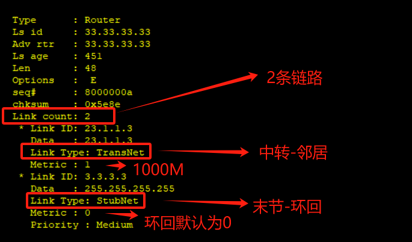
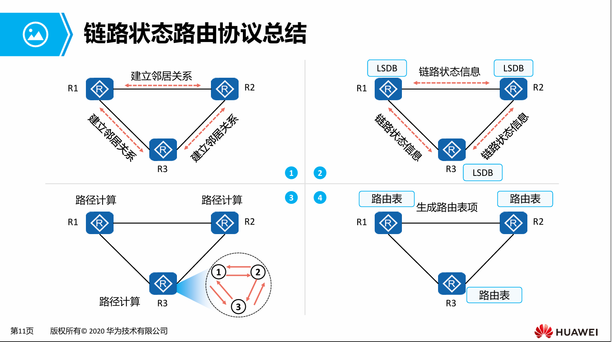

# 链路状态协议原理及OSPF的RID


## OSPF -- 开放最短路径优先协议 -- 链路状态协议

- 链路状态协议就是类似所有的路由器都拥有一张完全一致的“地图”
- 对于目标，是根据“地图”计算得出的  
- OSPF的数据库 -- 其实就是OSPF协议的“地图”，每一台OSPF路由器拥有完全一致的“地图”   
  为什么会完全一致？首先会有OSPF的邻居关系  
- dis ospf lsdb //查看ospf数据库
```
[ar3]dis ospf lsdb

	 OSPF Process 10 with Router ID 33.33.33.33
		 Link State Database 

		         Area: 0.0.0.0
 Type      LinkState ID    AdvRouter          Age  Len   Sequence   Metric
 Router    11.11.11.11     11.11.11.11       1165  36    80000004       1
 Router    22.22.22.22     22.22.22.22        444  48    8000000E       1
 Router    33.33.33.33     33.33.33.33        434  48    8000000A       1
 Network   23.1.1.3        33.33.33.33        434  32    80000005       0
 Network   12.1.1.2        22.22.22.22       1156  32    80000003       0
 
[ar3]dis ospf lsdb router 33.33.33.33

	 OSPF Process 10 with Router ID 33.33.33.33
		         Area: 0.0.0.0
		 Link State Database 


  Type      : Router
  Ls id     : 33.33.33.33
  Adv rtr   : 33.33.33.33  
  Ls age    : 451 
  Len       : 48 
  Options   :  E  
  seq#      : 8000000a 
  chksum    : 0x5e8e
  Link count: 2
   * Link ID: 23.1.1.3     
     Data   : 23.1.1.3     
     Link Type: TransNet     
     Metric : 1
   * Link ID: 3.3.3.3      
     Data   : 255.255.255.255 
     Link Type: StubNet      
     Metric : 0 
     Priority : Medium

```
 

### 配置OSPF
```
AR1

<ar1>sys
Enter system view, return user view with Ctrl+Z.
[ar1]ospf 10 router-id 11.11.11.11
[ar1-ospf-10]area 0 	
[ar1-ospf-10-area-0.0.0.0]network 12.1.1.1 0.0.0.0
[ar1-ospf-10-area-0.0.0.0]di th
[V200R003C00]
#
 area 0.0.0.0 
  network 12.1.1.1 0.0.0.0 
#
return
[ar1-ospf-10-area-0.0.0.0]
```
```
AR2

<ar2>sys
Enter system view, return user view with Ctrl+Z.	
[ar2]ospf 10 router-id 22.22.22.22
[ar2-ospf-10]area 0	
[ar2-ospf-10-area-0.0.0.0]network 12.1.1.2 0.0.0.0	
[ar2-ospf-10-area-0.0.0.0]network 23.1.1.2 0.0.0.0
[ar2-ospf-10-area-0.0.0.0]di th
[V200R003C00]
#
 area 0.0.0.0 
  network 12.1.1.2 0.0.0.0 
  network 23.1.1.2 0.0.0.0 
#
return
[ar2-ospf-10-area-0.0.0.0]
```

```
AR3

<ar3>sys
Enter system view, return user view with Ctrl+Z.
[ar3]ospf 10 router-id 33.33.33.33
[ar3-ospf-10]area 0
[ar3-ospf-10-area-0.0.0.0]network 3.3.3.3 0.0.0.0
[ar3-ospf-10-area-0.0.0.0]network 23.1.1.3 0.0.0.0
[ar3-ospf-10-area-0.0.0.0]di th
[V200R003C00]
#
 area 0.0.0.0 
  network 3.3.3.3 0.0.0.0 
  network 23.1.1.3 0.0.0.0 
#
return
[ar3-ospf-10-area-0.0.0.0]
```
### 查看AR1路由表信息
```
[ar1]dis ip routing-table 
Route Flags: R - relay, D - download to fib
------------------------------------------------------------------------------
Routing Tables: Public
         Destinations : 9        Routes : 9        

Destination/Mask    Proto   Pre  Cost      Flags NextHop         Interface

        3.3.3.3/32  OSPF    10   2           D   12.1.1.2        GigabitEthernet
0/0/0
       12.1.1.0/24  Direct  0    0           D   12.1.1.1        GigabitEthernet
0/0/0
       12.1.1.1/32  Direct  0    0           D   127.0.0.1       GigabitEthernet
0/0/0
     12.1.1.255/32  Direct  0    0           D   127.0.0.1       GigabitEthernet
0/0/0
       23.1.1.0/24  OSPF    10   2           D   12.1.1.2        GigabitEthernet
0/0/0
      127.0.0.0/8   Direct  0    0           D   127.0.0.1       InLoopBack0
      127.0.0.1/32  Direct  0    0           D   127.0.0.1       InLoopBack0
127.255.255.255/32  Direct  0    0           D   127.0.0.1       InLoopBack0
255.255.255.255/32  Direct  0    0           D   127.0.0.1       InLoopBack0

[ar1]ping 3.3.3.3
  PING 3.3.3.3: 56  data bytes, press CTRL_C to break
    Reply from 3.3.3.3: bytes=56 Sequence=1 ttl=254 time=30 ms
    Reply from 3.3.3.3: bytes=56 Sequence=2 ttl=254 time=30 ms
    Reply from 3.3.3.3: bytes=56 Sequence=3 ttl=254 time=30 ms
    Reply from 3.3.3.3: bytes=56 Sequence=4 ttl=254 time=40 ms
    Reply from 3.3.3.3: bytes=56 Sequence=5 ttl=254 time=30 ms

  --- 3.3.3.3 ping statistics ---
    5 packet(s) transmitted
    5 packet(s) received
    0.00% packet loss
    round-trip min/avg/max = 30/32/40 ms

```
### AR3重启 抓取AR2 与 AR3 之间的交互报文

### LSA-TYPE 常见的有 1 2 3 4 5 7
TYPE-1 类型1的LSA链路状态通告：
描述本设备的直连链路状态  
- 有没有链接ospf邻居  
有邻居的链路-Transit中转  
没邻居的链路-stub末节
- 该链路的开销是多少  
环回接口开销在华为中固定为0  
1000M的链路在华为中固定为1（公式）  

## 链路状态路由协议-LSA泛洪 （根据地图自己计算来的）

- 链路状态路由协议交互的是链路状态通告LSA，而不是路由信息
- 运行链路状态路由协议的路由器之间首先会建立邻居关系，然后彼此之间开始交互LSA（Link State
 Advertisement，链路状态通告）。


## 链路状态路由协议-LSDB维护
每台路由器都会产生LSA，路由器将接收到的LSA放入自己的LSDB（Link State DataBase，链路状态数
据库）。路由器通过对LSDB中所存储的LSA进行解析，进而了解全网拓扑。


## 链路状态路由协议-SPF计算
每台路由器基于LSDB，使用SPF（Shortest Path First，最短路径优先）算法进行计算。每台路由器都计算出一棵
以自己为根的、无环的、拥有最短路径的“树”。有了这棵“树”，路由器就已经知道了到达所有网段的优选
路径。


## 链路状态路由协议-路由表生成
路由器将计算出来的优选路径，加载进自己的路由表（RoutingTable）。




## OSPF概述
- OSPF是IETF定义的一种基于链路状态的内部网关路由协议。目前针对IPv4协议使用的是OSPF
 Version 2（RFC2328）；针对IPv6协议使用OSPFVersion3（RFC2740）。
- OSPF有以下优点：
1. [x] 基于SPF算法，以“累计链路开销”作为选路参考值
2. [x] 采用组播形式收发部分协议报文
3. [x] 支持区域划分
4. [x] 支持对等价路由进行负载分担
5. [x] 支持报文认证


## OSPF基础术语 - ROUTER ID
- Router ID用于在自治系统中唯一标识一台运行OSPF的路由器，它是一个32位的无符号整数。
- Router ID选举规则如下：  

1. [x] 手动配置OSPF路由器的Router ID（**建议手动配置**）
2. [x] 如果没有手动配置Router ID，则路由器使用Loopback接口中最大的IP地址作为Router ID
3. [x] 如果没有配置Loopback接口，则路由器使用物理接口中最大的IP地址作为Router ID
4. [x] 模拟器会使用第一个配置的ip地址作为RID，RID为了追求稳定性，一旦选举出就不可改变。除非重启设备或者重启OSPF进程，新RID才会生效


