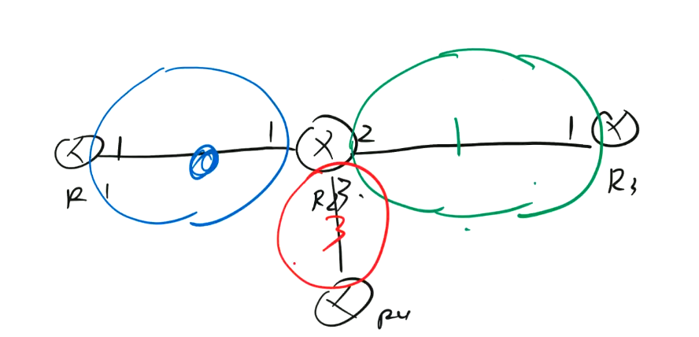
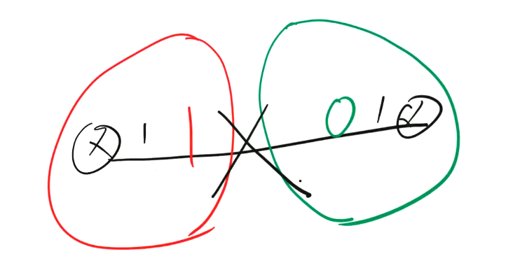
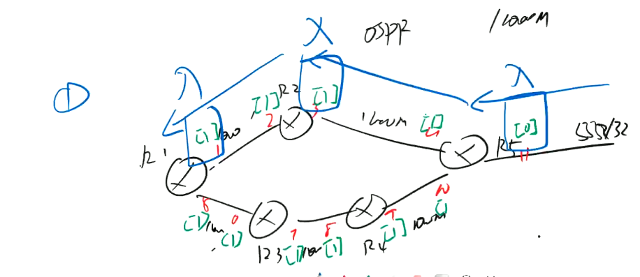
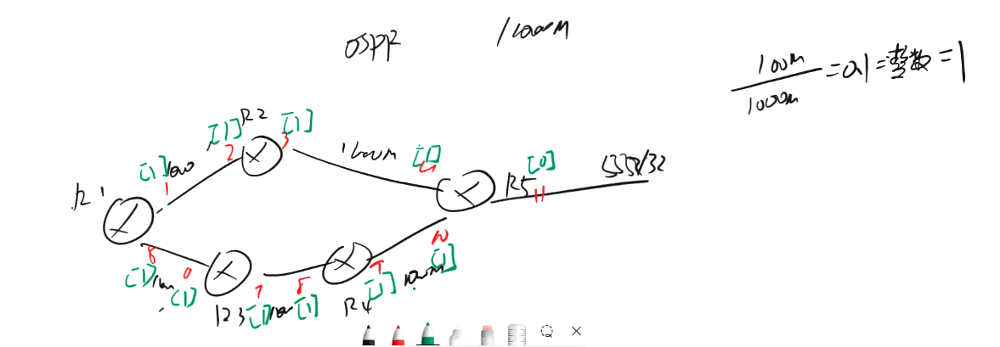
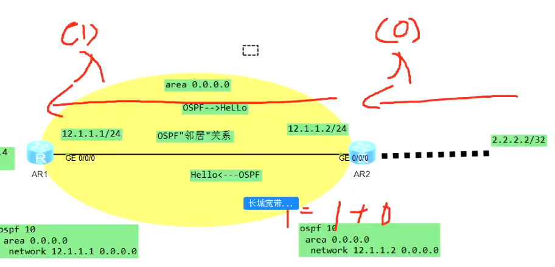
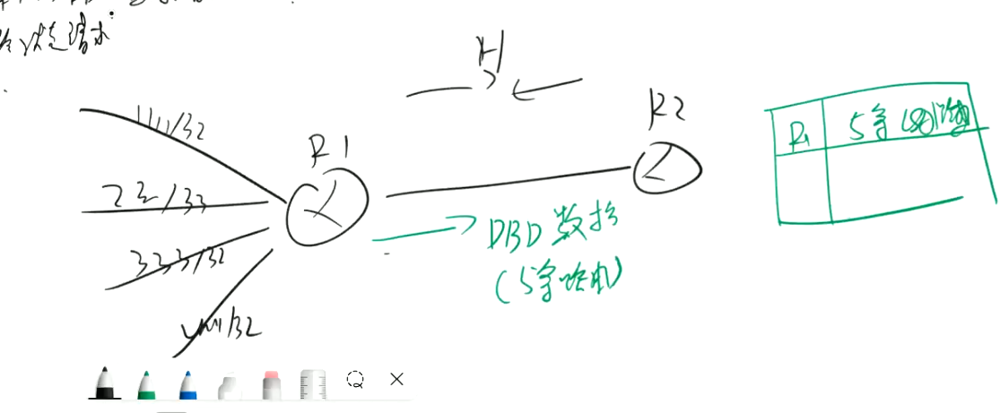
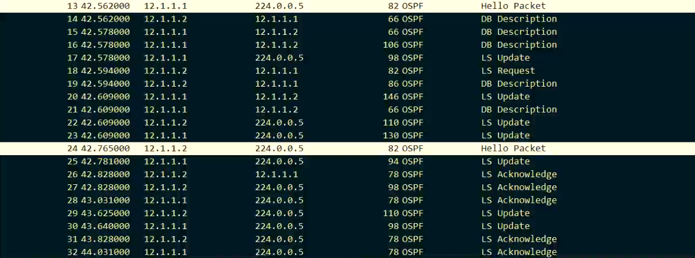
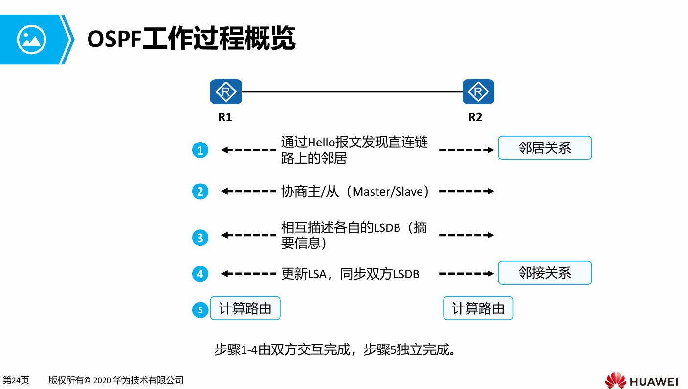

# OSPF基础回顾
## OSPF
### 1、工作原理  
* 链路状态协议   
OSPF/ISIS
* 距离矢量协议  
RIP
* 链路状态和距离矢量的区别在  
距离矢量：目标距离有多远，方向在哪里
链路状态：
建立邻居
交互LSA（链路状态通告）
以自己为根，通过SPF算法计，LSDB数据库计算出结果  
写入RIB表中

### 2、工作区域 
* IGP内部网络协议  
OSPF/ISIS/RIP
* EGP外部网络协议  
BGP
### 3、版本
* OSPFV2 RFC2328 → IPV4
* OSPFV3 RFC2740 → IPV6（华为）/ IPV4 ＆ IPV6 （CISCO）
### 4、术语
* RID → OSPF路由标识 ‘唯一’  
一、手工配置 （优先级最高）  
二、lookback ip 大的  
三、选择物理接口 ip 大的  
四、RID 具有稳定性，一旦选举，修改RID →   
&emsp;    1、重启OSPF进程（一般选这个）  
&emsp;    2、重启路由器  
五、全局RID （华为独有） 为所有协议配置的RID，如果协议单独配置RID，则会选用协议配置的RID  
```【huawei】router id 1.2.3.4```
* AREA 区域
逻辑上多个设备划分到相同的‘组’
一、AREA是基于接口的，而不是设备

二、相同区域的接口才能建立OSPF邻居关系

三、表示方法：32位类似IP地址的值
* 度量值 COST/METRIC  
OSPF使用Cost（开销）作为路由的度量值。   
每一个激活了OSPF的接口都会维护一个接口Cost值，缺省的接口Cost = 100 Mbit/s 接口带宽 。其中100 Mbit/s为OSPF指定的缺省参考值，该值是可配置的。  
OSPF以“累计cost”为开销值，也就是流量从源网络到目的网络所经过所有路由器的出接口的cost总和。  
OSPF衡量路由的‘优劣’  
`**路由学习‘入’方向的累计开销** `   
* 
环回接口的度量值始终为0（华为）  


修改权重方法：在入接口修改cost  
``ospf cost *``  
为什么要调整OSPF COST？ 为了选路
* OSPF三大表项  
1、OSPF邻居表  
没有邻居，没有路由  -- 排错第一步  
2、OSPF link state database 链路状态数据库  
同一区域的LSDB，所有路由器完全一致，不同区域可能不一样  
3、OSPF的路由表  ➡️每台路由器根据LSDB，以自己为根计算所有的OSPF路由，按需增加    
`OSPF的路由表 ≠ 路由表，直连不会计算，右边显示的direct而非OSPF`  
如果邻居建立正常，但是路由不正常，需要去查看各个路由器LSDB的情况
* OSPF的报文
一、hello 建立和维护OSPF的邻居关系  
默认10s一次发送
二、DBD/DD  database description 数据库描述

三、Link state request 链路状态请求 根据DBD目录去请求详细的LSA（路由）  
四、Link state update 链路状态更新 发送具体的LSA链路状态通告  
五、Link state ack 链路状态确认 对收到的LSU 链路状态更新进行确认

* OSPF的邻居关系
* OSPF的邻接关系  
邻居是邻接的前提，但是邻居不一定是邻接

* OSPF的邻居状态机  
一、down 关闭  
OSPF刚启动，没有收到领居的hello报文  

二、init 初始化  
收到邻居的hello报文后，但是不包含自己的RID  

三、2-way 双向确认  
收到了邻居的hello报文，包含自己的RID  //两边同时进入2-way状态，邻居关系正式建立

四、exstart 预启动  

五、exchange 预交换  

六、loading 加载  

七、full 邻居（领接）  

八、attept 尝试启动  


