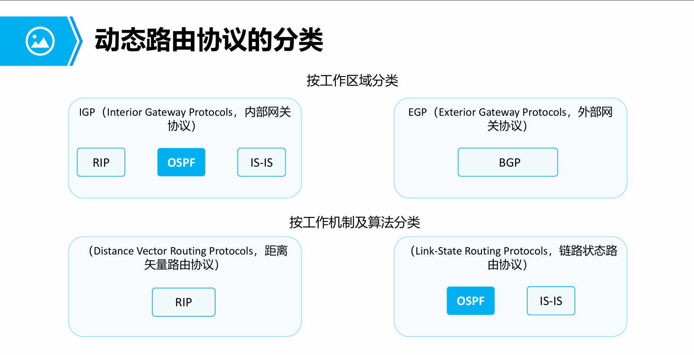
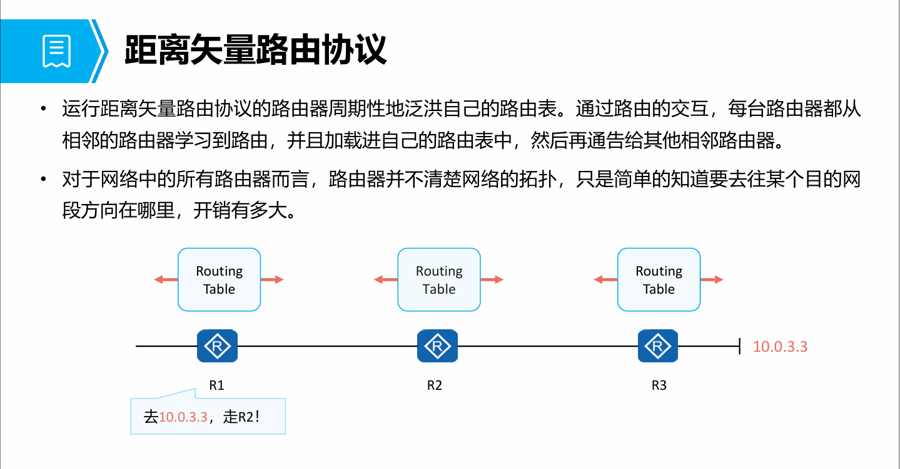

# OSPF开放最短路径优先协议
## OSPF基础

- 路由器根据路由表转发数据包，路由表项可通过**手动配置**和动态路由协议生成。
- 静态路由比动态路由使用更少的带宽，并且不占用CPU资源来计算和分析路由更新。当网
络结构比较简单时，只需配置静态路由就可以使网络正常工作。但是**当网络发生故障或
者拓扑发生变化后，静态路由不会自动更新，必须手动重新配置。**
- 相比较于静态路由，动态路由协议具有更强的可扩展性，具备更强的应变能力。
- OSPF（Open Shortest Path First，开放式最短路径优先）具有扩展性强，收敛速度快等特
点，作为**优秀的内部网关协议被广泛使用**。
- 本课程主要介绍OSPF的基本概念、OSPF邻接关系的建立、以及OSPF的基本配置。

