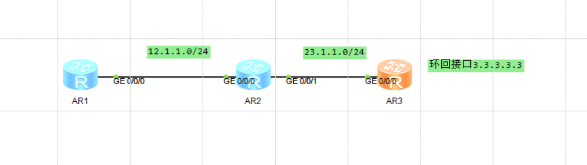

# OSPF开放最短路径优先协议
## OSPF基础

- 路由器根据路由表转发数据包，路由表项可通过**手动配置**和动态路由协议生成。
- 静态路由比动态路由使用更少的带宽，并且不占用CPU资源来计算和分析路由更新。当网
络结构比较简单时，只需配置静态路由就可以使网络正常工作。但是**当网络发生故障或
者拓扑发生变化后，静态路由不会自动更新，必须手动重新配置。**
- 相比较于静态路由，动态路由协议具有更强的可扩展性，具备更强的应变能力。
- OSPF（Open Shortest Path First，开放式最短路径优先）具有扩展性强，收敛速度快等特
点，作为**优秀的内部网关协议被广泛使用**。
- 本课程主要介绍OSPF的基本概念、OSPF邻接关系的建立、以及OSPF的基本配置。


### 距离矢量协议--Routing Information Protocol 路由信息协议
版本1 -- 广播 -- 路由更新  
版本2 -- 组播 -- 路由更新 -- 224.0.0.9  
RIP有类型路由 进行路由宣告 不需要携带掩码部分  
- 如果是A类路由只需要宣告前8位  
- 如果是B类路由只需要宣告前16位  
- 如果是C类路由只需要宣告前24位  
  
 
 ``` 
AR1配置ip

The device is running!

<Huawei>sys
Enter system view, return user view with Ctrl+Z.
[Huawei]sysn	
[Huawei]sysname ar1
[ar1]int g0/0/0
[ar1-GigabitEthernet0/0/0]ip ad	
[ar1-GigabitEthernet0/0/0]ip address 12.1.1.1 24
Jul 17 2024 10:57:43-08:00 ar1 %%01IFNET/4/LINK_STATE(l)[0]:The line protocol IP
 on the interface GigabitEthernet0/0/0 has entered the UP state. 
[ar1-GigabitEthernet0/0/0]
```

```
AR2 配置ip
The device is running!

<Huawei>sys
Enter system view, return user view with Ctrl+Z.
[Huawei]sysn	
[Huawei]sysname ar2
[ar2]int g0/0/0
[ar2-GigabitEthernet0/0/0]ip add 12.1.1.2 24
[ar2-GigabitEthernet0/0/0]
Jul 17 2024 10:58:06-08:00 ar2 %%01IFNET/4/LINK_STATE(l)[0]:The line protocol IP
 on the interface GigabitEthernet0/0/0 has entered the UP state. 
[ar2-GigabitEthernet0/0/0]int g0/0/1
[ar2-GigabitEthernet0/0/1]ip add 23.1.1.2 24
[ar2-GigabitEthernet0/0/1]
Jul 17 2024 10:58:29-08:00 ar2 %%01IFNET/4/LINK_STATE(l)[1]:The line protocol IP
 on the interface GigabitEthernet0/0/1 has entered the UP state. 
[ar2-GigabitEthernet0/0/1]
```

```
AR3配置ip
The device is running!

<Huawei>sys
Enter system view, return user view with Ctrl+Z.
[Huawei]sysn	
[Huawei]sysname ar3
[ar3]int g0/0/0
[ar3-GigabitEthernet0/0/0]ip add 23.1.1.3 24
Jul 17 2024 10:58:46-08:00 ar3 %%01IFNET/4/LINK_STATE(l)[0]:The line protocol IP
 on the interface GigabitEthernet0/0/0 has entered the UP state. 
[ar3-GigabitEthernet0/0/0]
```
